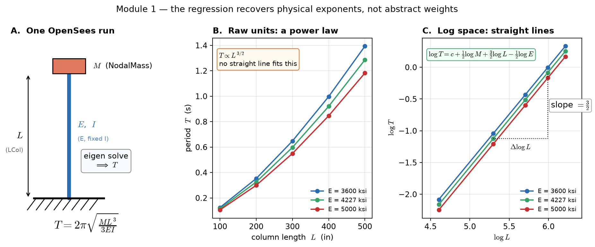

# Module 1 — Regression on HPC

**needs a TACC allocation**

A simple end-to-end ML workflow on DesignSafe using `dapi` and the
general-purpose `python-s3` app. Sweeps a 2D cantilever pushover in OpenSeesPy
across `NodalMass × LCol × E`, then fits a linear regression that recovers
`T = 2π·√(M·L³ / (3·E·I))` from the data.

**First of six modules.** It submits to a TACC queue, so run it at the start of
the session and collect the results at the end — the queue wait hides behind
Modules 2–5. The cantilever swept here is the same beam that Module 2 fits a
neural network to, Module 4 solves with a PINN, and Module 5 learns an operator
for. The catch it sets up for Module 2: the regression is exact **because we knew
to take logarithms**.

Unlike Modules 2–5, this one needs an allocation. The rest are CPU-only.

## What the regression is doing



A cantilever with a lumped tip mass has lateral stiffness `k = 3EI/L³`, so

```
T = 2π·√(M/k) = 2π·√(M·L³ / (3·E·I))
```

That is a power law, and no straight line fits it (panel B). Taking logarithms turns
the products into sums and the exponents into slopes:

```
log T = c + 0.5·log M + 1.5·log L − 0.5·log E        c = log(2π/√(3I))
```

so in log space the data falls on straight, parallel lines (panel C) — which is what
ordinary least squares is built to fit. The three fitted coefficients are therefore
**physical exponents**, not abstract weights.

### What the verified run returned

| Coefficient | Recovered | Exact | Meaning |
| --- | --- | --- | --- |
| `bias` | −5.657665 | `log(2π/√(3I))` | absorbs `2π` and the fixed `I` |
| `log_NodalMass` | **+0.500000** | +1/2 | `T ∝ √M` — heavier is slower |
| `log_LCol` | **+1.500000** | +3/2 | `T ∝ L^1.5` — the dominant term |
| `log_E` | **−0.500000** | −1/2 | `T ∝ 1/√E` — stiffer is faster |

`R² = 1.0000` on both the 60 training and 15 held-out runs, residuals at machine
epsilon (`max|r| ≈ 8e-15`).

Because the physics is exact, the fit is a **test of the whole workflow**: anything
other than `[0.5, 1.5, −0.5]` with `R² = 1` means the sweep, staging, a task output,
or the aggregation broke. A single failed task would show up here.

The ML layer is a standard supervised pipeline — feature matrix → train/test split
→ sklearn `LinearRegression` (with a `numpy.linalg.lstsq` fallback) → JSON model
artifact → diagnostic figure. It runs on OpenSees data generated by the sweep
itself, so it needs no external dataset.

## Files

| File                          | Role                                                                |
| ----------------------------- | ------------------------------------------------------------------- |
| `cantilever.py`               | One PyLauncher task: runs an OpenSeesPy pushover, writes `metrics.json`. |
| `aggregate_and_train.py`      | Aggregates `out_*/metrics.json` and fits the regression.            |
| `postprocess.py`              | Renders diagnostic PDF/PNG (histograms, predicted-vs-truth, residuals, coefficients). |
| `setup.sh`                    | Pre-script (`PRE_SCRIPT`): copies the TACC-compiled `OpenSeesPy.so` into the job. |
| `ml_post.sh`                  | Post-script (`POST_SCRIPT`): invokes `aggregate_and_train.py` and `postprocess.py` after PyLauncher finishes. |
| `requirements.txt`            | Extra packages (`scikit-learn`, `matplotlib`) installed into the job's temp environment (`PIP_REQUIREMENTS`). |
| `01-opensees-ml-regression.ipynb`| **The Module 1 notebook**: defines the sweep, submits via `dapi`, inspects outputs. |
| `01-opensees-ml-workflow-dag.ipynb`| *Optional variant*: the same study as a two-job DAG (see below).   |

## How it runs

```
sweep grid ──► parametric_sweep.generate ──► runsList.txt + call_pylauncher.py
                                                       │
                                             staged/inputs.zip (all 8 files,
                                             ONE Tapis transfer instead of 8)
                                                       │
                                                       ▼
                                       python-s3 (Stampede3)
                                       ├─ inputs.zip expanded first (UNZIP_INPUTS)
                                       ├─ setup.sh (PRE_SCRIPT): stages OpenSeesPy.so
                                       ├─ requirements.txt (PIP_REQUIREMENTS): temp job venv
                                       ├─ Main: python3 call_pylauncher.py
                                       │   └─ N × cantilever.py tasks
                                       │       └─ out_*/metrics.json
                                       └─ ml_post.sh (POST_SCRIPT, required)
                                           ├─ aggregate_and_train.py
                                           │   └─ ml_results/*.{json,csv,txt}
                                           └─ postprocess.py
                                               └─ ml_results/*_diagnostics.{pdf,png}
```

Because the physics is exact, the regression should report
`coef ≈ [const, 0.5, 1.5, -0.5]` with `R² = 1.0` — a clean confirmation
that the workflow plumbing is correct.

## Run locally (no Tapis)

```bash
mkdir -p tmp_runs/out_4.19_100_3600 tmp_runs/out_4.99_500_5000
python3 cantilever.py --NodalMass 4.19 --LCol 100 --E 3600 \
    --outDir tmp_runs/out_4.19_100_3600
python3 cantilever.py --NodalMass 4.99 --LCol 500 --E 5000 \
    --outDir tmp_runs/out_4.99_500_5000
python3 aggregate_and_train.py --indir tmp_runs --outdir tmp_runs/ml_results
python3 postprocess.py --indir tmp_runs/ml_results
cat tmp_runs/ml_results/opensees_ml_report.txt
open tmp_runs/ml_results/opensees_ml_diagnostics.pdf  # or .png
```

## Run on DesignSafe

See **`01-opensees-ml-regression.ipynb`** — that is the Module 1 notebook, and the
one linked from the session agenda.

## Optional variant: the same study as a DAG

`01-opensees-ml-workflow-dag.ipynb` runs the *identical* 75-run study, but as an
explicit **directed acyclic graph** instead of one monolithic job:

```
sweep (48-core PyLauncher job) ──archive_uri──> train (1-core job)
```

The two stages become separate Tapis jobs wired by the sweep's archive location, and
DesignSafe's workflow service submits each one as its dependencies finish — so the
run continues after you close the notebook. The payoff: a **retrain costs one core
instead of a 48-core resweep**, and each stage sizes its own resources. The price is
one extra queue wait and staging pass.

**Not part of the three-hour session** — it is published as an optional sub-section.
It also has a prerequisite: run the main notebook first, through bundling the inputs,
so the staged inputs exist at `/MyData/dapi-staging/staged`.

Verified end-to-end on `python-s3` v1.0.0 (Stampede3, job
`b1d13ae7-d2fc-4e06-9249-31b4e37384d0-007`): 75 tasks in 42 s across one SKX
node, `coef = [0.500, 1.500, -0.500]`, `R² = 1.0` train and test.

**Placeholder note:** the sweep uses `EMOD`, not `E` — with the default token
placeholder style, a bare `E` would also match inside the `--E` flag and mangle
the commands.
